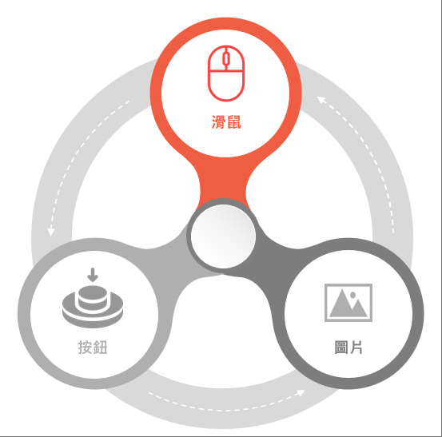

## 拼車猜猜

---

### 組員
- 11036006 **王佑強** 
- 11036023 **陳友亮**
---
### 專案簡述
- 目標受眾 : 國中小學童
- 系統動機 : 身為一個許多不同小遊戲的愛好者，下載單一遊戲不僅玩的快，也散的快，所以會不停下載更多遊戲使得硬體占滿大部分空間。經過兩學期的學習，藉由上課所教的東西並整合起來。若無法改變現有遊戲開發的設計，充當遊戲開發者並製作出理想型遊戲遊玩。
- 系統目的 : 
  1. 在一個應用程式提供多種遊戲
  2. 讓使用者易於學習，培養腦力、反應的能力
  3. 實作並重新複習過去所學，培養邏輯概念
- 系統架構

---
### 介面設計

- 簡潔有力、一目瞭然
- 多種顏色變化
- 多使用圖片
---
### 技術簡述
#### 觸發事件

- 圖片事件 :  
  - Image物件新增Event Trigger事件
  - Type選取 Pointer Click，並執行對應的函數。
- 滑鼠事件 :  
    - Input.GetMouseButtonDown(0)
    - 當滑鼠在場景任意處按下左鍵按鈕時觸發
- 按鈕事件 :
    - Button物件新增OnClick事件並套用函式
    - 當點擊Button按鈕時觸發函式

---
### 分工

---